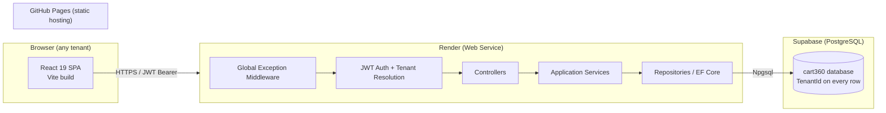

# Cart360 — Software Architecture

## 1. Overview

Cart360 is a multi-tenant SaaS billing, quotation, inventory, and business
management platform. A single deployed instance of the API and a single
PostgreSQL database serve every tenant ("Company"). Tenant isolation is
enforced in software (discriminator column + EF Core global query filters +
defense-in-depth checks at the API boundary), not by provisioning separate
databases per customer. This keeps operational cost low while scaling to
thousands of companies on shared infrastructure.



## 2. Guiding Principles

- **Clean Architecture** on the backend: dependencies point inward
  (`API → Application → Domain`, `Infrastructure → Application/Domain`).
  Domain has zero framework references.
- **Repository + Service Layer**: controllers never touch `DbContext`
  directly. Services own business rules (subscription limit checks, stock
  movement, GST math); repositories own persistence/query concerns.
- **Tenant isolation is structural, not incidental**: every tenant-scoped
  entity implements `ITenantEntity` (`TenantId`), every EF Core query is
  filtered by a `HasQueryFilter` bound to the current request's tenant, and
  every write path re-validates the resource's `TenantId` against the caller's
  JWT claim before mutating — so a compromised or buggy filter can never
  leak across tenants silently.
- **Everything auditable**: `CreatedAt/By`, `UpdatedAt/By`, `IsDeleted`
  (soft delete), `RowVersion` (optimistic concurrency) on every business
  table, plus a dedicated `AuditLogs` table capturing before/after JSON for
  sensitive mutations (invoices, stock, users, subscriptions).
- **Subscription limits are enforced server-side**, in a single
  `ISubscriptionLimitService`, called from the service layer before any
  create operation that is capacity-bound (users, products, customers,
  monthly bills, quotations, prints, storage, employees). The frontend only
  reflects these limits for UX; it is never the source of truth.

## 3. Backend — Clean Architecture Layering

```
Cart360.Domain           <- Entities, enums, value objects, domain events, interfaces (no EF, no ASP.NET)
Cart360.Application      <- DTOs, FluentValidation validators, AutoMapper profiles,
                             service interfaces + implementations, CQRS-style request/response,
                             ISubscriptionLimitService, ITenantContext abstraction
Cart360.Infrastructure   <- EF Core DbContext, entity configurations (Fluent API),
                             repository implementations, migrations, external services
                             (email/SMTP, storage, PDF), Identity/JWT/token generation
Cart360.API              <- Controllers, middleware (global exception, tenant resolution,
                             rate limiting), DI composition root, Swagger, Program.cs
```

Dependency rule enforced by project references only — `Domain` has no
project references at all; `Application` references `Domain`;
`Infrastructure` references `Application` + `Domain`; `API` references all
three but contains no business logic.

### 3.1 Request pipeline

```
HTTP request
  → RateLimiting middleware
  → Global Exception middleware (catches everything downstream, maps to ProblemDetails)
  → Authentication (JWT bearer) → Authorization (role/permission policies)
  → TenantResolutionMiddleware (reads TenantId claim, sets ITenantContext, rejects
    cross-tenant header/param mismatches)
  → Controller (thin — maps DTO in, calls IService, maps result out)
  → Application Service (business rules, subscription limit checks, orchestration)
  → Repository (IGenericRepository<T> + module-specific repos) → EF Core → PostgreSQL
```

### 3.2 Authentication & Authorization

- **JWT access token** (short-lived, 15 min) carries `sub`, `tenantId`,
  `role`, `email`, `permissions` (compact claim for Employee-level
  module permissions).
- **Refresh token** (opaque, random 256-bit, hashed at rest, 7/30-day
  sliding expiry for "remember me"), stored in `RefreshTokens` table with
  rotation-on-use and reuse detection (if a used/expired token is replayed,
  all descendant tokens for that user are revoked).
- **Roles**: `SuperAdmin`, `CompanyAdmin`, `Employee`, `CompanyUser`
  (read-only). Authorization uses ASP.NET Core policies
  (`RequireRole`) plus a custom `[RequirePermission("Invoices.Create")]`
  attribute/filter for Employee-level granular permissions stored in
  `UserPermissions`.
- **Tenant validation**: every non-SuperAdmin token embeds `tenantId`;
  `TenantResolutionMiddleware` sets `ITenantContext.TenantId` from the
  claim (never from a client-supplied header/body field), and EF Core's
  global query filter uses that same `ITenantContext` — so there is one
  source of truth for "which tenant is this request".
- **Email verification / OTP / password reset**: `OtpCodes` table with a
  `Purpose` discriminator (EmailVerification, PasswordReset, Login2FA),
  6-digit codes, short expiry (10 min), rate-limited per email.

### 3.3 Cross-cutting

- **Global Exception Middleware** → RFC 7807 `ProblemDetails` responses,
  structured logging (Serilog) with correlation/request IDs.
- **Validation**: FluentValidation validators run via an MVC filter before
  controller actions execute; all validation failures return 400 with a
  uniform error shape.
- **Logging**: Serilog → console (Render captures stdout) + optional
  Postgres/Seq sink; enriched with `TenantId`, `UserId`, `RequestId`.
- **Rate limiting**: ASP.NET Core built-in `Microsoft.AspNetCore.RateLimiting`,
  stricter fixed-window policy on `/auth/*` endpoints to blunt credential
  stuffing/OTP brute force.

## 4. Multi-Tenancy Strategy

**Shared database, shared schema, discriminator column** (`TenantId uuid`)
— chosen over database-per-tenant or schema-per-tenant because:

- Cart360 targets thousands of small/medium companies; per-tenant databases
  would multiply Supabase connection/maintenance overhead and complicate
  migrations (thousands of databases to migrate in lockstep).
- A single schema lets Super Admin run cross-tenant analytics
  (revenue, growth, active companies) with plain SQL instead of fan-out
  queries.
- EF Core global query filters make the isolation automatic for 95% of
  code paths; the remaining 5% (raw SQL, bulk jobs) go through a reviewed
  `IUnitOfWork.ExecuteAsTenantAsync` helper that stamps `TenantId`.

Every tenant-scoped table carries `TenantId` with a composite index
`(TenantId, Id)` (or `(TenantId, <natural key>)` where relevant, e.g.
`(TenantId, InvoiceNumber)` unique) so tenant-scoped lookups stay index-only
even at large row counts. `SuperAdmin`-only tables (`Tenants`,
`SubscriptionPlans`, `TenantSubscriptions`, platform-level `AuditLogs`) have
no `TenantId` — they describe tenants, they don't belong to one.

## 5. Subscription Enforcement

```
CompanyAdmin action (e.g. "create product")
  → ProductService.CreateAsync
      → ISubscriptionLimitService.EnsureCanAddAsync(tenantId, LimitType.Products)
          → reads TenantSubscriptions + SubscriptionPlans for current plan
          → counts current usage (cached per-tenant, short TTL)
          → throws SubscriptionLimitExceededException if at/over cap
      → proceeds to repository insert only if allowed
```

The same gate wraps: Users, Employees, Products, Customers, monthly
Invoices, Quotations, Print actions, and Storage (file upload size against
cumulative tenant storage). `CanExportPdf`, `CanExportExcel`, `CanPrint`,
`CanAddLogo`, `CanAddGst`, `CanAddMultiBranch`, `CanUseApi` are boolean
feature flags checked the same way at the relevant action.

## 6. Frontend Architecture

```
client/src/
  app/            <- router, providers (QueryClient, Theme, Auth), App shell
  features/       <- one folder per module (invoices, quotations, products, ...)
    <feature>/
      api/          React Query hooks (useInvoicesQuery, useCreateInvoiceMutation)
      components/   feature-local components
      pages/        route-level pages
      types.ts
  components/     <- shared/reusable UI (DataTable, PageHeader, ConfirmDialog, ...)
  layouts/        <- AppLayout (sidebar+navbar+breadcrumb), AuthLayout, PrintLayout
  lib/            <- axios instance + interceptors, query client, permissions helper
  hooks/          <- cross-feature hooks (usePermission, useSubscriptionLimits)
  print/          <- print templates (A4, Thermal80, Thermal58, Letter) as pure
                     components rendered through react-to-print / react-pdf
  store/          <- lightweight client state (auth session, theme, sidebar) — React Context
  theme/          <- MUI theme (light/dark, tokens, glassmorphism surfaces)
```

- **TanStack Query** owns all server state (caching, retries, optimistic
  updates); no Redux — client-only UI state (sidebar collapsed, theme) lives
  in small React Contexts.
- **Axios instance** with request interceptor (attach access token) and
  response interceptor (on 401, attempt silent refresh via refresh token
  once, else redirect to login).
- **React Hook Form + zod/yup resolver** for every form; shared form field
  components wrap MUI inputs.
- **Route-level code splitting** (`React.lazy`) per feature to keep the
  GitHub Pages bundle lean.
- **Permission-aware rendering**: a `usePermission("Invoices.Create")` hook
  reads the decoded JWT + `UserPermissions` fetched at login, driving both
  route guards and conditional UI (buttons/menu items hidden, not just
  disabled).

## 7. Deployment Topology

| Layer    | Platform | Notes |
|----------|----------|-------|
| Frontend | GitHub Pages | Static build (`vite build`) published via GitHub Actions to `gh-pages` branch; `VITE_API_BASE_URL` injected at build time per environment. |
| Backend  | Render (Web Service) | Docker or native .NET buildpack; `render.yaml` defines service, health check `/health`, env vars from Render dashboard/secrets. |
| Database | Supabase (PostgreSQL) | Connection via pooled Npgsql connection string (Supabase pgbouncer transaction pooling for the API's steady-state load, direct connection reserved for migrations). |

Full deployment steps are covered in later phases (deliverables 15-20).

## 8. Solution/Repo Layout

Single monorepo (see `docs/folder-structure.md` for the full tree):

```
Cart360/
  client/     React 19 + Vite SPA
  server/     ASP.NET Core 9/10 Clean Architecture solution
  database/   Raw SQL (schema.sql, seed.sql) — source of truth reviewed
              alongside EF Core migrations, not a replacement for them
  docs/       Architecture, schema, ERD, deployment docs
```
