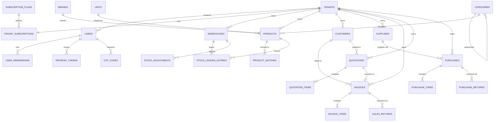

# Cart360 — Database Design

Target: PostgreSQL 15+ (Supabase). Full DDL lives in
[`database/schema.sql`](../database/schema.sql); this document explains the
design decisions behind it. EF Core migrations (generated later from the
C# entity models) are the actual source of truth applied to environments —
`schema.sql` is a reviewable, human-readable snapshot kept in sync with the
initial migration and used for quick local `psql` bring-up.

## Conventions

| Concern | Decision |
|---|---|
| Primary keys | `uuid DEFAULT gen_random_uuid()` on every table — avoids sequential-ID enumeration across tenants, and lets offline clients pre-generate IDs before syncing (see "Offline cache" feature). |
| Tenant isolation | Every tenant-scoped table has `tenant_id uuid NOT NULL REFERENCES tenants(id) ON DELETE CASCADE`, always the first indexed column in composite indexes/uniques. Platform tables (`tenants`, `subscription_plans`, `tenant_subscriptions`, `platform_audit_logs`) have none — they describe tenants. |
| Audit columns | `created_at timestamptz`, `updated_at timestamptz`, `created_by uuid`, `updated_by uuid` (FK to `users`) on every business table. |
| Soft delete | `is_deleted boolean NOT NULL DEFAULT false` on every business table; app-level global query filter excludes it. Reference/lookup tables use `is_active` instead where "delete" really means "stop offering it". |
| Optimistic concurrency | `version integer NOT NULL DEFAULT 1` on every mutable business table, incremented by an EF Core `SaveChanges` interceptor and mapped as a concurrency token — matches the "Version" column requested and stays portable (vs. Postgres-specific `xmin`). |
| Enums | Modeled as `varchar` + `CHECK` constraint, not native Postgres `ENUM` types — native enums are painful to evolve under EF Core migrations (`ALTER TYPE ... ADD VALUE` can't run in a transaction). C# `enum` + `HasConversion<string>()` maps to the same columns. |
| Money | `numeric(14,2)`. Quantities: `numeric(14,3)` (fractional units like kg/litre). Percentages: `numeric(5,2)`. |
| Extensions | `pgcrypto` (for `gen_random_uuid()`), `citext` (case-insensitive email/code comparisons). |

## Entity-Relationship Overview

## Table Groups

1. **Platform** (no `tenant_id`): `subscription_plans`, `tenants`,
   `tenant_subscriptions`, `platform_audit_logs`.
2. **Identity**: `users`, `user_permissions`, `refresh_tokens`, `otp_codes`,
   `notifications`, `activity_logs`.
3. **Catalog**: `warehouses`, `categories` (self-referencing for
   sub-category), `brands`, `units`, `products`, `product_batches`.
4. **Parties**: `customers`, `suppliers`.
5. **Sales**: `invoices`, `invoice_items`, `quotations`, `quotation_items`,
   `sales_returns`, `sales_return_items`.
6. **Purchasing**: `purchases`, `purchase_items`, `purchase_returns`,
   `purchase_return_items`.
7. **Inventory**: `stock_ledger_entries` (append-only movement log —
   the single source of truth `current_stock` is derived/cached from),
   `stock_adjustments`, `stock_adjustment_items`.
8. **Finance**: `expense_categories`, `expenses`, `income_categories`,
   `incomes`, `payments` (money out), `receipts` (money in).
9. **Settings**: `printer_settings`.

## Key Design Decisions

- **`stock_ledger_entries` is append-only and authoritative.** `products.current_stock`
  is a denormalized cache updated in the same DB transaction as each ledger
  insert (via the Application service, not a DB trigger, so business rules
  stay in C#) — this keeps stock reads O(1) while `stock_ledger_entries`
  gives a full audit trail ("Stock History / Stock Ledger" requirement) and
  lets us rebuild `current_stock` from history if it ever drifts.
- **Quotation → Invoice conversion** is modeled as `quotations.converted_invoice_id`
  (nullable FK, unique) rather than duplicating line items into a new table —
  conversion copies `quotation_items` rows into `invoice_items` at conversion
  time so each remains independently editable afterward.
- **`user_permissions` is per-user, per-module**, not role-based, because the
  spec requires the Company Admin to assign granular permissions to each
  Employee individually rather than picking from fixed role templates.
  `CompanyAdmin` and `SuperAdmin` bypass this table entirely (full access by
  role); `CompanyUser` is implicitly view-only and never gets rows here.
- **Composite uniqueness is always tenant-scoped**: e.g.
  `UNIQUE (tenant_id, invoice_number)`, `UNIQUE (tenant_id, sku)`,
  `UNIQUE (tenant_id, customer_code)` — the same invoice number is free to
  repeat across different companies.
- **`ON DELETE CASCADE` from `tenants`** is intentional: Super Admin's
  "Delete company" action is explicit and permanent per spec, and cascading
  avoids orphaned rows across ~30 tenant-scoped tables. Everyday "remove
  this product" style operations go through the application's soft-delete
  path (`is_deleted = true`), never a hard `DELETE`.
